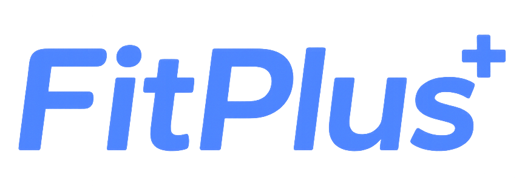

  

# FitPlus

**FitPlus는 별도 웨어러블 기기 없이 브라우저 카메라만으로 사용자의 운동 자세를 분석하고, 반복 횟수, 자세 점수, 피드백을 제공하는 실시간 AI 운동 코칭 서비스입니다.**

### FitPlus 서비스 주소

- [FitPlus를 사용해보세요!](https://fitplus.cloud/)

### 소개 영상

- [FitPlus의 소개 영상은 제작중에 있어요!]()

### 상세 소개 페이지

- [FitPlus의 상세 소개를 확인해보세요!](https://kookmin-sw.github.io/2026-capstone-14/)

### 팀 소개

| 이름 | 역할 | 기여 내용 |
| --- | --- | --- |
| 남재준 | 팀장, AI 담당 | 프로젝트 총괄, AI 기능 설계 및 구현 |
| 이창조 | Frontend, Backend, Cloud 배포 담당 | DB 및 웹 개발, 배포 환경 구성 |