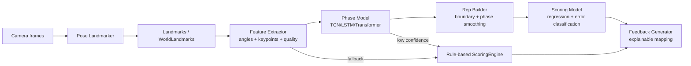
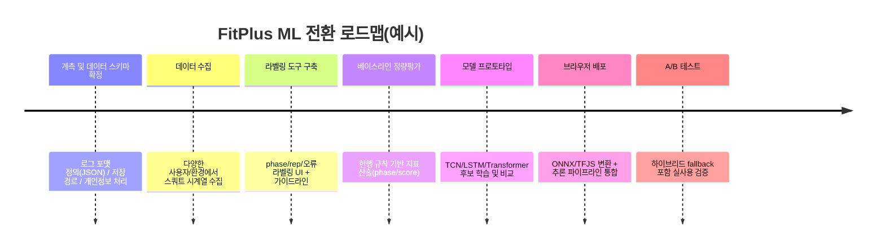

# FitPlus 운동 로직 심층 분석 보고서

## 요약

본 저장소의 운동/피트니스 핵심 로직은 **브라우저에서 MediaPipe Pose 기반 포즈 랜드마크를 추론**하고, 이를 **각도(angles)로 변환**한 뒤, **DB에서 내려받은 채점 프로파일(scoring_profile_metric.rule)을 규칙 기반으로 평가**하여 프레임 점수(0~100)를 만들고, 이를 **반복(Rep) 카운팅 및 구간(phase) 추적 로직**에 입력해 **Rep 단위 점수/피드백**을 산출하는 구조입니다. citeturn29view2turn8view1turn32view0turn31search0turn31search3

특히 스쿼트는 전용 모듈이 존재하며, **프레임 품질 게이트(quality gating)** → **DESCENT/BOTTOM/ASCENT/LOCKOUT 페이즈 분할** → **페이즈별 통계 요약(summary) 누적** → **Rep 점수 보정(신뢰도 factor, 하드 실패 캡)**의 파이프라인을 갖습니다. citeturn30view1turn20view0turn20view2turn16view4turn29view2

현재의 “페이즈-기반 규칙 채점”은 **가정(카메라 뷰 안정, 관절 가시성, 속도 범위, 임계값 적절성)**이 만족될 때는 합리적으로 동작할 여지가 있으나, (1) **속도/노이즈/스무딩에 매우 민감한 임계값 기반 페이즈 전이**, (2) **뷰/원근에 의존하는 2D 좌표 기반 정렬 지표**, (3) **일부 항목(tempo/hold 등)의 미구현·기본값 처리**, (4) **“프레임 점수 → Rep 점수” 집계의 통계적 의미(어느 구간에서 무엇을 평가해야 하는가) 불명확성** 등의 한계가 코드 수준에서 확인됩니다. citeturn23view1turn12view1turn20view0turn6view3turn8view5

ML/DL로의 전환은 **페이즈 분할(temporal segmentation)**과 **자세 오류 분류/점수 회귀**에서 정확도 개선 가능성이 높지만, 저장소에는 **학습 데이터/라벨 스키마가 명시되어 있지 않으므로**(공개 리포지토리에서 데이터 패키지/라벨 파일을 확인하기 어려움) 먼저 **최소 데이터 요건·라벨링 설계·평가 체계**를 확립해야 합니다. citeturn26search1turn29view2turn32view0

---

## 저장소 운동 로직 구조와 핵심 코드 위치

### 전체 실행 흐름

세션 루프는 `session-controller.js`에서 “포즈 결과(angles) → 프레임 점수 계산 → Rep 카운터 업데이트” 순으로 연결되어 있습니다. 핵심 연결점은 다음 코드로 확인됩니다.

```js
const rawScoreResult = scoringEngine.calculate(angles);
repCounter.update(angles, rawScoreResult.score);
```

citeturn29view2

또한 Rep заверш(완료) 시에는 `repCounter.repEvaluator`를 통해 Rep 기록이 `scoringEngine.scoreRep(repRecord)`로 후처리(운동별 Rep 채점)됩니다.

```js
repCounter.repEvaluator = (repRecord) => scoringEngine.scoreRep(repRecord);
```

citeturn29view0turn29view4

따라서 **프레임 채점(ScoringEngine.calculate)**과 **Rep/페이즈 추적(RepCounter + 운동 모듈)**이 분리되어 있고, 스쿼트처럼 전용 모듈이 있으면 Rep 단위 점수/피드백이 추가로 보정됩니다. citeturn35view0turn13view1turn16view4

### 페이즈 분할(구간화) 구현 위치와 함수

- `public/js/workout/rep-counter.js`
  - `detectState(angle)`: NEUTRAL/TRANSITION/ACTIVE 상태 분류(임계값 ±10 완충)
  - `checkRepCompletion(now)`: “NEUTRAL → ACTIVE → NEUTRAL” 패턴과 최소시간(minDuration/minActiveTime)으로 Rep 완료 판정
  - `aggregateScores(scores)`: Rep 점수 집계(5% trimmed mean)
  - `updateRepTracking(...)`: 운동 모듈이 있으면 모듈의 `updateRepTracking` 위임(스쿼트 페이즈 로직 연결) citeturn12view1turn12view5turn13view0turn13view1

- `public/js/workout/exercises/squat-exercise.js`
  - `getFrameGate(angles)`: 프레임 품질/뷰가 충분할 때만 채점·카운팅 허용
  - `updateRepTracking(...)`: 스쿼트 전용 페이즈 계산(`detectPhase`) 및 페이즈별 통계 누적(`recordFrame`)
  - `detectPhase(repCounter, angles, primaryAngle)`: DESCENT/BOTTOM/ASCENT/LOCKOUT 추정(각도 변화량(delta) + nearBottom/nearLockout 규칙)
  - `recordFrame(...)`, `recordPhaseFrame(...)`: 페이즈별/전체(overall) 통계(summary) 누적 citeturn30view1turn18view2turn20view0turn20view2

### 점수화(Scoring) 구현 위치와 함수

- `public/js/workout/scoring-engine.js`
  - `calculate(angles)`: 프로파일 메트릭 반복, `evaluateMetric`과 가중 평균으로 프레임 점수 산출(+ 피드백 생성)
  - `evaluateMetric(value, rule, maxScore)`: rule.type 및 ideal_min/ideal_max 등에 따른 점수 산식 분기
  - `evaluateIdealRange`, `evaluateRange`, `evaluateHold` 등: 규칙별 점수 함수
  - `scoreRep(repRecord)`: 운동 모듈이 있으면 모듈의 `scoreRep(this, repRecord)`를 호출(스쿼트 Rep 후처리)
  - `pickMetric/pickPhaseMetric`: 스쿼트 모듈이 summary에서 페이즈별 통계치를 뽑을 때 사용 citeturn8view1turn8view7turn7view4turn7view5turn35view1

- `public/js/workout/exercises/squat-exercise.js`
  - `scoreRep(scoringEngine, repRecord)`: summary 기반으로 지표별 점수/가중치 집계 후, 신뢰도 factor 반영 및 하드 실패 캡 적용 citeturn16view4turn20view4

### 저장소가 전제하는 데이터 타입

이 구현은 **IMU(가속도/자이로) 신호 처리 코드가 아니라**, `PoseEngine`에서 MediaPipe Pose 결과인 `poseLandmarks / poseWorldLandmarks`를 받아 각도를 계산하는 형태입니다. 또한 MediaPipe Pose Landmarker는 이미지 좌표 랜드마크와 3D 월드 좌표를 모두 출력할 수 있음을 공식 문서가 명시합니다. citeturn22view1turn23view2turn31search0turn31search3

---

image_group{"layout":"carousel","aspect_ratio":"16:9","query":["MediaPipe Pose 33 landmarks example","squat exercise phases descent bottom ascent lockout diagram","pose keypoints skeleton overlay exercise coaching"],"num_per_query":1}

---

## 규칙 기반 페이즈별 채점의 수학적·실무적 타당성 평가

### 현재 구현이 사실상 계산하는 “점수”의 정의

프레임 점수는 다음 형태로 정의됩니다.

- 각 메트릭에 대해 `actualValue = getMetricValue(angles, metric.key)`를 계산하고, null이면 스킵
- `metricScore = evaluateMetric(actualValue, rule, max_score)`
- 최종 프레임 점수: `round( Σ(metricScore * weight) / Σ(weight) )` citeturn7view1turn8view1

Rep 점수는 기본적으로 다음 중 하나의 샘플 집합을 골라 `aggregateScores`(5% trimmed mean)로 평균합니다.

- 운동 모듈이 페이즈 추적을 제공하면(`usesMovementPhases()`), `currentMovementScores`(DESCENT/BOTTOM/ASCENT) 우선, 없으면 ACTIVE 구간 점수로 폴백
- `aggregateScores`: 정렬 후 상·하위 5% trimming(표본 10개 이상일 때) 후 평균 citeturn12view5turn13view0turn13view2

스쿼트는 여기에 더해 `scoreRep`에서 summary 기반으로 다시 가중 집계하고, `confidence.factor`로 스케일링하며, 특정 “하드 실패(hardFails)”에 대해 점수 상한을 강제합니다. citeturn16view4turn20view4

즉, 현재 시스템은 “정답 점수”라기보다 **(규칙 기반 메트릭 점수) × (구간 집계) × (신뢰도 보정/캡)**의 함수로 정의되는 경험적 스코어입니다. citeturn8view7turn13view0turn16view4

### 핵심 가정과 그 취약점

가정은 코드에 매우 구체적으로 박혀 있으며, 이 가정이 깨지면 채점의 의미가 급격히 약해집니다.

- **가정: 전신이 충분히 프레임 안에 있고 관절 추적 품질이 일정 이상이다.**  
  스쿼트는 `trackedJointRatio`, `inFrameRatio`, `view`, `quality.score`에 하드 게이트를 걸어 미충족 시 채점 자체를 중단합니다. 이는 실무적으로 합리적이지만(쓰레기 입력을 막음), 동시에 사용 환경(카메라/조명/가림)에 따라 “채점 불가”가 자주 발생할 수 있습니다. citeturn30view1turn23view1turn29view2

- **가정: 페이즈는 ‘무릎 각도’ 변화량과 임계값(nearBottom/nearLockout)으로 안정적으로 분할된다.**  
  `detectPhase`는 `delta`(프레임 간 각도 차)와 `movingDown/movingUp` 임계값(±1.5), 그리고 nearBottom/nearLockout 조건을 사용합니다. 느린 동작(각도 변화가 작음), 스무딩(미분값 감소), 프레임 드롭(시간 불균일)에서 페이즈가 틀어질 가능성이 큽니다. citeturn20view0turn22view1turn18view2

- **가정: 특정 지표(예: 무릎 정렬/무릎-발끝)는 2D 좌표 차이로 충분히 근사된다.**  
  `PoseEngine.getKneeAlignment()`는 무릎과 발목의 x차이를 활용하고, alignment 임계값(0.05)을 고정합니다. 이는 카메라 각도/거리/원근에 민감하며, 정면/측면 뷰에 따라 동작 의미가 달라질 수 있습니다. citeturn23view4turn8view5turn16view3

- **가정: DB rule이 충분히 정교하며, 없는 rule은 0.7×maxScore로 기본 부여해도 괜찮다.**  
  `evaluateMetric`는 rule이 비어 있으면 `maxScore * 0.7`을 반환합니다. 이는 데이터 누락/설계 미완을 “일단 70점”으로 흡수하는 전략인데, 평가의 엄밀성을 떨어뜨릴 수 있습니다. citeturn8view7turn32view0

- **가정: tempo/hold 등 시간 기반 요소는 현재 구조에서 크게 중요치 않거나 추후 구현될 것이다.**  
  `evaluateTempo`는 “기본 점수(0.7×maxScore)”를 반환하도록 주석과 함께 사실상 미구현 상태입니다. 따라서 tempo가 채점 항목에 포함될 경우 점수 의미가 붕괴합니다. citeturn6view3turn8view5

### 노이즈 민감도와 실패 모드

이 파트는 “왜 수학적으로 불안정해질 수 있는가”를 정리합니다.

- **임계값 기반 전이의 채터링(chattering)**  
  `detectState`는 NEUTRAL/ACTIVE 경계에서 ±10도 완충을 두지만, 관절각 계산 노이즈가 큰 경우 TRANSITION↔ACTIVE가 빈번히 오갈 수 있습니다. 이는 ACTIVE 체류시간(`activeTimeMs`)과 phase tracking을 흔듭니다. citeturn12view1turn12view4

- **스무딩(One Euro Filter) ↔ 시간 미분 임계값의 충돌**  
  `PoseEngine`은 One Euro Filter를 사용해 랜드마크를 스무딩합니다. One Euro Filter는 속도에 따라 컷오프를 조정해 지터와 지연을 트레이드오프하는 필터로 알려져 있습니다. 이때 `detectPhase`가 `delta` 임계값(±1.5)에 의존하므로, 필터 파라미터가 바뀌면 페이즈 전이 기준이 사실상 바뀝니다. citeturn22view1turn20view0turn31search1turn31search16

- **프레임레이트 변동/드롭에 대한 내재적 취약성**  
  스쿼트는 `deltaMs = min(now - lastFrame, 120)`로 cap을 둡니다. 프레임이 크게 밀리면 실제 지속시간보다 짧게 누적될 수 있고, “tempo/구간 길이” 기반 지표를 추가했을 때 오류가 커집니다. citeturn18view2turn20view2

- **뷰 분류(정면/측면) 불안정 시 지표 선택/해석 오류**  
  `PoseEngine`은 월드 랜드마크 기반으로 view를 분류하고, view history로 안정도를 계산합니다. view가 흔들리면 스쿼트 모듈이 “어떤 지표를 라이브로 보여줄지/어느 페이즈 지표를 우선할지” 결정이 바뀔 수 있습니다. citeturn23view1turn16view2turn30view1

### “타당성”을 정량적으로 판단하기 위한 기준 제안

현재 구현을 “수학적으로/실무적으로 타당하다”고 말하려면, 최소한 아래 지표를 측정해야 합니다(제안 스펙).

페이즈 분할(프레임 라벨링 관점):

- **페이즈별 Precision/Recall/F1 (macro-F1 포함)**  
  라벨: {NEUTRAL, DESCENT, BOTTOM, ASCENT, LOCKOUT}. citeturn20view0turn17view1
- **전이 시점 오차(temporal alignment error)**  
  예: DESCENT→BOTTOM, BOTTOM→ASCENT, ASCENT→LOCKOUT 전이 시점의 MAE(밀리초). 스쿼트 구현이 프레임 간 시간을 120ms로 cap하므로, 실무 임계값을 정할 때 “프레임 드롭을 고려한 허용오차”를 별도로 정의해야 합니다. citeturn18view2turn20view2
- **과분할(over-segmentation) 지표**  
  액션 세그멘테이션 문헌에서는 과분할을 edit score/segmental F1로 측정하고, 이를 줄이기 위한 smoothing loss 등을 사용합니다. 현재 임계값 기반 로직도 과분할이 발생할 수 있으므로 동일 지표를 적용하는 것이 비교에 유리합니다. citeturn31search17turn31search5turn31search2

Rep 카운팅 관점:

- **Rep 검출 F1**(rep boundary 이벤트 단위) 및 **세션 총 reps 절대오차(|Δreps|)**  
  현재는 “NEUTRAL→ACTIVE→NEUTRAL + minDuration + minActiveTime” 규칙이므로, ground truth와 비교해 누락(false negative)·오검출(false positive)을 분해해야 합니다. citeturn12view5turn36view1

점수(회귀/평가) 관점:

- **전문가 점수 대비 MAE/RMSE + 상관계수(Pearson/Spearman) + ICC(가능하면)**  
  스쿼트 모듈은 `confidence.factor`로 점수를 스케일하고 hard fail cap을 적용하므로, “원 점수(baseScore)”와 “최종 점수(finalScore)” 모두를 평가해야 원인 분석이 가능합니다. citeturn16view4turn20view4
- **노이즈 강건성(robustness) 곡선**  
  스무딩 on/off, 가시성 저하(visibility drop), 랜드마크 dropout을 가한 후 성능이 어떻게 열화되는지 측정(성능-노이즈 곡선). One Euro Filter가 지터·지연 트레이드오프임을 고려하면 필수입니다. citeturn22view1turn31search16

---

## ML/DL로 대체 시 기대효과와 최소 데이터 요구사항

### ML/DL이 개선을 만들 가능성이 큰 지점

현재 규칙 기반은 구조적으로 “단일/소수 각도 + 임계값 + 휴리스틱”에 강하게 의존합니다. 이 타입의 규칙은 구현·설명은 쉬우나, 환경/속도/개인차에 취약해 일반화가 어렵습니다. 이에 비해 ML/DL은 다음 영역에서 기대효과가 큽니다.

- **페이즈 분할(Temporal Segmentation)**  
  스쿼트의 DESCENT/BOTTOM/ASCENT는 전형적인 시계열 세그멘테이션 문제이며, dilated temporal convolution 기반의 MS-TCN 계열은 과분할을 완화하는 구조/손실을 제안합니다. citeturn31search17turn31search5turn31search2
- **스켈레톤(키포인트) 기반 동작 인식/분류**  
  ST-GCN 계열은 스켈레톤 시퀀스를 그래프로 보고 시공간 그래프 컨볼루션으로 패턴을 학습합니다(규칙 기반 대비 일반화 장점). citeturn33search5turn33search1
- **자세 오류 분류 및 점수 회귀**  
  국내에서도 OpenPose 기반으로 스쿼트 등 운동 동작을 딥러닝(DNN/CNN)으로 분류하는 연구가 보고되어 있으며, IMU 기반 스쿼트 자세 분류에서도 딥러닝이 정확도 향상에 기여했다는 결과가 있습니다. (단, 본 저장소는 기본적으로 pose 기반이므로 IMU는 선택적 확장으로 간주하는 것이 안전합니다.) citeturn34search6turn34search18
- **브라우저 배포 용이성**  
  ONNX Runtime Web, TensorFlow.js는 브라우저에서 모델 추론을 지원합니다(현 저장소가 웹앱이므로 아키텍처적으로 맞음). citeturn33search3turn34search3turn34search12turn33search23

### 데이터/라벨이 불명시된 상태에서의 리스크

저장소 문서·코드 흐름 상 “운동 수행 로그(detail) 저장”은 DB 설계에 존재하지만, **ML 학습용 데이터셋(키포인트 시계열 + 페이즈 라벨 + 점수 라벨)**이 리포지토리에 포함되어 있거나 라벨 규격이 확정된 흔적은 확인하기 어렵습니다. citeturn32view0turn29view2turn26search1

이 경우 ML/DL은 다음 리스크가 큽니다.

- 라벨 정의가 모호하면 모델이 “무엇을 맞추는지” 불명확(특히 BOTTOM의 정의: 최저점 1프레임인지, 정지 구간인지)
- 개인차(가동범위, 체형, 카메라 위치) 분산이 크면 데이터가 많이 필요
- 점수 라벨(0~100)이 사람 평가라면 평가자 일치도(ICC) 관리가 필요

### 최소 데이터 요구사항과 라벨링 스키마 제안

아래는 “저장소에 데이터가 없거나 불충분할 때”를 전제로 한 **최소 스키마 제안**입니다(수량은 프로젝트 상황에 맞게 조정).

#### 입력 데이터 스키마(권장)

- timestamp (ms), fps 추정치
- MediaPipe Pose landmarks: 33개 (x,y,z,visibility)  
- poseWorldLandmarks (가능할 때): 33개 (x,y,z)
- 파생 특징: 저장소가 이미 계산 중인 angles(무릎/힙/척추 등), kneeAlignment, quality(view 포함) citeturn31search0turn23view2turn23view1turn23view4turn22view1

#### 라벨 스키마(필수)

- frame-level phase 라벨: {NEUTRAL, DESCENT, BOTTOM, ASCENT, LOCKOUT}
- rep boundary 이벤트: rep_start, rep_end (또는 rep_id를 frame에 부여)
- view 라벨(옵션): FRONT/SIDE/UNKNOWN
- 품질 라벨(옵션): HIGH/MEDIUM/LOW (현재 코드의 quality level을 그대로 활용 가능) citeturn30view1turn23view1turn20view2

#### 점수 라벨(선택지)

- (권장) Rep-level score: 0~100 연속값 + 하드 실패 플래그(depth_not_reached 등)  
  현재 스쿼트 모듈이 hard fail cap을 갖고 있으므로, 우선은 “오류 유형 분류 + 보조 점수 회귀”가 더 안정적입니다. citeturn16view4turn20view4
- (대안) 등급형(5점 척도) + 세부 오류(무릎/허리/깊이 등) 멀티라벨

#### 데이터 증강(augmentation) 전략

포즈 시계열에 적합한 증강은 다음이 실용적입니다.

- 시간축 변형: random time-warp, 속도 스케일(느리게/빠르게)
- 공간 노이즈: landmark 좌표에 가우시안 노이즈, visibility 기반 dropout(가림 시뮬레이션)
- 좌우 반전: skeleton mirror(단, view/정렬 지표는 재정의 필요)
- 구간 잘라붙이기: rep 단위로 random crop/pad (Transformer/TCN 입력 길이 맞춤)

---

## 제안 ML/DL 모델 설계

### 제안 파이프라인 개요



(본 파이프라인은 저장소의 기존 규칙 기반을 **fallback**으로 유지하는 “하이브리드”를 전제로 합니다.) citeturn29view2turn35view0turn30view1

### 입력 특징 설계

현 저장소는 이미 `angles`, `kneeAlignment`, `quality(view 포함)`를 계산합니다. ML은 다음 두 계열 중 하나로 설계하는 것이 깔끔합니다.

- **경량(angles 중심) 특징**  
  - angles: knee/hip/spine/shoulder 등 + 좌우 대칭 값(kneeSymmetry 등)
  - 1차 미분(속도): Δangle/Δt
  - quality: score, trackedJointRatio, inFrameRatio, viewStability, view label  
  → 장점: 차원이 낮아 데이터가 적어도 학습이 안정적. citeturn23view2turn23view1turn8view5turn20view3

- **고정밀(keypoints 중심) 특징**  
  - 33 landmarks (x,y,z,visibility) + 정규화(골반 중심, 스케일)
  - worldLandmarks가 있으면 3D 특징 강화  
  → 장점: 다양한 오류 패턴을 포착 가능(그러나 데이터 요구량 증가). citeturn31search0turn23view2turn22view1

### 학습 타겟과 손실함수

#### 타겟

- **타겟 A: phase classification (frame-level)**  
  출력: T×K softmax (K=5 phases)
- **타겟 B: boundary detection (event-level 또는 frame-wise binary)**  
  출력: T×2 (start/end) 또는 CTC 스타일
- **타겟 C: rep score regression (rep-level)**  
  출력: rep마다 0~100 (또는 등급)

#### 손실 함수(권장 조합)

- Phase: cross-entropy + (과분할 완화) smoothing loss  
  MS-TCN은 과분할을 줄이기 위한 smoothing loss를 제안합니다. citeturn31search17turn31search5
- Score: Huber(=smooth L1) 또는 MSE  
- Multi-task: `L = λ_phase L_phase + λ_bnd L_bnd + λ_score L_score` (λ는 실험으로 튜닝)

### 모델 후보 아키텍처와 하이퍼파라미터 범위

아래는 “브라우저 실시간 코칭”을 고려한 후보들입니다.

| 모델 | 입력 | 출력 타겟 | 강점 | 약점 | 권장 하이퍼파라미터 범위 | 배포 난이도 |
|---|---|---|---|---|---|---|
| 경량 TCN (dilated) | angles(+Δ) | phase/boundary | 병렬 처리, 긴 수용영역, 안정적 | 매우 복잡한 오류는 한계 | channels 32~128, kernel 3~5, layers 4~10, dilation 1~2^L | 중 |
| MS-TCN / MS-TCN++ | angles 또는 keypoints | phase(better smoothing) | 과분할 감소, 세그멘테이션 특화 | 구현 복잡, 데이터 필요 | stages 2~4, layers/stage 4~10, channels 64~256 | 상 |
| Bi-LSTM/GRU | angles(+Δ) | phase/boundary | 구현 쉬움, 소규모 데이터에서 강함 | 병렬성 낮음, 긴 시퀀스 비용 | hidden 64~256, layers 1~3, dropout 0.1~0.5 | 중 |
| Transformer Encoder | angles 또는 keypoints | phase/score | 장거리 의존성, 멀티태스크 | 데이터/튜닝 부담, 브라우저 비용 | d_model 64~256, heads 2~8, layers 2~6, seq len 60~240 | 상 |
| ST-GCN 계열 | keypoints(스켈레톤) | phase/오류분류 | 스켈레톤 구조 반영, 일반화 잠재력 | 구현/전처리 복잡 | blocks 6~10, channels 64~256 | 상 |

- TCN의 타당성/장점은 시퀀스 모델링에서 CNN 계열이 RNN(LSTM)보다 성능/기억 길이에서 강력할 수 있음을 보인 연구를 참고할 수 있습니다. citeturn33search0turn33search4
- Transformer 구조의 기본은 “Attention Is All You Need”가 제안한 self-attention 기반 인코더/디코더이며, 시계열에도 널리 확장됩니다. citeturn33search2turn33search6
- 스켈레톤 기반 ST-GCN은 skeleton sequence의 공간-시간 패턴을 학습합니다. citeturn33search5turn33search1
- Action segmentation 관점에서는 MS-TCN/MS-TCN++ 계열이 대표적입니다. citeturn31search17turn31search2

### 예상 컴퓨팅 요구(정성적)

- **학습**: (angles 기반 TCN/LSTM) 일반적인 단일 GPU에서도 충분히 가능(데이터 규모에 좌우).  
- **추론(브라우저)**: ONNX Runtime Web 또는 TensorFlow.js로 가능하며, 모델 크기/시퀀스 길이를 제한하고 Worker/WebGPU 활용을 고려해야 합니다. citeturn33search3turn33search19turn34search3turn34search12turn33search23

---

## 실험 비교 계획

### 데이터셋 구성

저장소 DB 설계상 `workout_session.detail(JSONB)` 등에 시계열 로그 저장이 가능하므로, “현 앱을 계측(instrumentation)하여 수집”하는 구성이 자연스럽습니다. citeturn32view0turn29view2

권장 데이터 분할은 다음 원칙을 따르는 것이 안전합니다.

- **피험자(사람) 기준 분리**: train/val/test가 사용자 단위로 겹치지 않도록(개인별 스켈레톤 편향 방지)
- **환경 분리(가능하면)**: 카메라/조명/배경 조건을 균형 있게
- **운동별 분리**: 우선 스쿼트부터(현재 전용 모듈이 스쿼트에 집중) citeturn14view0turn30view1

### 베이스라인 정의

- **Baseline-R0 (현행 규칙 기반)**  
  `RepCounter.detectState + squatExercise.detectPhase + ScoringEngine.evaluateMetric` 전체 파이프라인. citeturn12view1turn20view0turn8view7
- **Baseline-R1 (규칙 기반 + 품질 게이트 제거/완화)**  
  `getFrameGate`의 임계값을 변화시켜 품질-성능 trade-off를 측정. citeturn30view1turn23view1
- **Baseline-ML0 (경량 kNN 포즈 분류 + Rep 카운팅)**  
  MediaPipe는 포즈 분류/반복 카운팅 예시로 kNN 기반 접근을 공식 문서에 제시합니다(간단하지만 강력한 비교축). citeturn31search22turn31search3

### 비교 실험 설계

- **교차검증**:  
  - 소규모면 LOSO(Leave-One-Subject-Out) 권장  
  - 규모가 커지면 GroupKFold(그룹=사용자)
- **평가 지표(phase)**: per-phase F1, segmental F1, edit score, 전이 시점 MAE
- **평가 지표(score)**: MAE/RMSE, Spearman, ICC(가능 시), 하드 실패 검출 정확도(멀티라벨 F1)
- **리소스 지표**: 브라우저 추론 latency(ms), 모델 다운로드 크기(MB), CPU/WebGPU 점유율(평균/피크)

### Ablation(절제) 스터디

아래 절제는 “어디서 성능이 나오는지”를 설명하기 위해 거의 필수입니다.

- 입력 특징: angles만 vs angles+Δ vs keypoints+angles
- 스무딩: One Euro Filter on/off (또는 파라미터 변화) citeturn22view1turn31search16
- view 사용: view feature 포함 vs 제거(뷰 오분류 민감도)
- 페이즈 모델만 ML로 교체 vs 점수까지 ML로 교체(하이브리드 효과)

### 통계적 유의성 검정(권장)

- 사용자 단위로 집계한 metric에 대해 **paired test**(예: Wilcoxon signed-rank)  
- 또는 부트스트랩으로 개선폭의 95% CI 추정(특히 MAE/편집점수)  
- 목표 성공 기준은 “현행 대비 >X% 개선”으로 두되, X는 프로젝트 목표/데이터 노이즈 수준에 맞춰 사전 등록(pre-registration)하는 것을 권장합니다(요청사항에 따라 X 값은 본 보고서에서 특정하지 않음).

### 결과 정리용 표 템플릿

아래 표는 “모델-지표-리소스”를 한 눈에 비교하기 위한 템플릿입니다(값은 실험 후 기입).

| 실험군 | Phase macro-F1 | Segmental F1 | Edit score | Transition MAE(ms) | Score MAE | Spearman | Latency(ms) | Model size(MB) | 비고 |
|---|---:|---:|---:|---:|---:|---:|---:|---:|---|
| Baseline-R0(현행) |  |  |  |  |  |  |  |  |  |
| Baseline-ML0(kNN) |  |  |  |  |  |  |  |  |  |
| TCN-small |  |  |  |  |  |  |  |  |  |
| MS-TCN (2-stage) |  |  |  |  |  |  |  |  |  |
| BiGRU-attn |  |  |  |  |  |  |  |  |  |
| Transformer-lite |  |  |  |  |  |  |  |  |  |
| ST-GCN-lite |  |  |  |  |  |  |  |  |  |

---

## 구현 로드맵과 저장소 통합 설계

### 로드맵 타임라인



(각 마일스톤의 “소요 기간”은 팀 규모/라벨링 인력/데이터 난이도에 따라 달라져 수치로 단정하지 않고, 아래에 작업 단위로 추정합니다.)

### 마일스톤별 작업 단위와 예상 소요(정성적)

- **계측(instrumentation) + 데이터 스키마**: 3~7일  
  - `session-controller.js`의 `handlePoseDetected`에서 landmarks/worldLandmarks/angles/quality/phase/state를 프레임 단위로 버퍼링하고, 세션 종료 시 JSON 다운로드 또는 서버 업로드. citeturn29view2turn22view1turn23view2
- **라벨링 가이드/도구**: 1~2주  
  - phase 정의(특히 BOTTOM), 오류 정의(무릎/허리/깊이) 문서화
- **베이스라인 평가**: 3~7일  
  - 본 보고서의 정량 지표를 모두 산출(phase F1, transition MAE 등)
- **모델 학습 파이프라인(Python)**: 1~2주  
  - 데이터 로더, 증강, 학습/검증, 실험관리
- **브라우저 추론 통합**: 1~2주  
  - ONNX Runtime Web 또는 TensorFlow.js로 모델 로딩/워커 분리/성능 튜닝 citeturn33search3turn34search12turn33search23
- **하이브리드 안정화**: 1~2주  
  - 품질 낮음/저신뢰 구간에서 규칙 기반 fallback(`getFrameGate`, `confidence.factor`)으로 안전장치 유지 citeturn30view1turn16view4turn23view1

### 저장소 통합 제안(모듈 위치와 API)

현 구조는 “운동별 모듈을 registry로 주입”하는 형태입니다. citeturn27view0turn29view0  
따라서 ML 모듈도 같은 패턴을 따르는 것이 유지보수에 유리합니다.

권장 디렉터리(예시):

- `public/js/workout/ml/`
  - `phase-model.js` (ONNX/TFJS 로더 + 시퀀스 버퍼)
  - `score-model.js` (rep summary 입력 → 점수/오류 출력)
  - `feature-extractor.js` (angles/keypoints 정규화)
- `public/js/workout/exercises/`
  - `squat-exercise-ml.js` (기존 `squat-exercise.js`를 확장/대체)

권장 인터페이스(개념):

- `phaseModel.update(features, timestamp) -> {phase, confidence, boundaries?}`
- `scoreModel.predict(repFeatures) -> {score, hardFails, softFails, feedback}`  
- 그리고 `squatExercise.updateRepTracking` 내부에서 `detectPhase`를 대체하되, `confidence`가 낮거나 품질이 낮으면 현행 규칙으로 fallback.

이 방식은 `ScoringEngine.scoreRep`가 운동 모듈의 `scoreRep`를 호출하는 확장 포인트를 이미 제공하므로 자연스럽게 “ML scoreRep”로 교체할 수 있습니다. citeturn35view0turn16view4

### 저장소에 데이터가 없을 때: 합성 데이터 생성 예시

아래는 “스쿼트 무릎각/힙각 시계열 + 페이즈 라벨”을 합성 생성하는 최소 예시 스크립트입니다. (실제 학습에는 현실 데이터를 권장하지만, 파이프라인 검증·유닛테스트·노이즈 민감도 실험에 유용합니다.)

```python
import json
import math
import random

def generate_squat_rep(fps=30, duration_sec=2.5, noise_deg=2.0):
    """
    단일 스쿼트 rep의 (knee_angle, hip_angle, phase) 합성 시계열 생성.
    - knee_angle: lockout(≈170) -> bottom(≈90) -> lockout
    - hip_angle : lockout(≈170) -> bottom(≈110) -> lockout (대략)
    """
    T = int(fps * duration_sec)
    seq = []
    # 0~1 정규화 시간
    for t in range(T):
        x = t / (T - 1)

        # piecewise smooth curve: down(0~0.45), bottom(0.45~0.55), up(0.55~1)
        if x < 0.45:
            s = x / 0.45
            knee = 170 - 80 * (0.5 - 0.5 * math.cos(math.pi * s))  # 170 -> 90
            hip  = 170 - 60 * (0.5 - 0.5 * math.cos(math.pi * s))  # 170 -> 110
            phase = "DESCENT"
        elif x < 0.55:
            knee = 90
            hip = 110
            phase = "BOTTOM"
        else:
            s = (x - 0.55) / 0.45
            knee = 90 + 80 * (0.5 - 0.5 * math.cos(math.pi * s))   # 90 -> 170
            hip  = 110 + 60 * (0.5 - 0.5 * math.cos(math.pi * s))  # 110 -> 170
            phase = "ASCENT"

        # 노이즈
        knee += random.gauss(0, noise_deg)
        hip  += random.gauss(0, noise_deg)

        seq.append({
            "t_ms": int(1000 * t / fps),
            "knee_angle": knee,
            "hip_angle": hip,
            "phase": phase
        })

    # 양끝에 LOCKOUT/NEUTRAL을 붙여 세션 형태로 확장 가능
    return seq

def generate_dataset(n_reps=200, out_path="synthetic_squat.jsonl"):
    with open(out_path, "w", encoding="utf-8") as f:
        for i in range(n_reps):
            rep = generate_squat_rep(
                fps=random.choice([24, 30, 60]),
                duration_sec=random.uniform(1.8, 4.0),
                noise_deg=random.uniform(0.5, 5.0),
            )
            f.write(json.dumps({"rep_id": i, "frames": rep}, ensure_ascii=False) + "\n")

if __name__ == "__main__":
    generate_dataset()
```

이 합성 데이터는 다음 용도에 적합합니다.

- 페이즈 모델(TCN/LSTM 등)의 입력/출력 shape 검증
- 노이즈 크기 변화에 따른 페이즈 F1 열화 곡선 테스트
- “전이 시점 MAE” 계산 로직 유닛테스트

---

## 참고문헌 및 권장 자료

아래는 본 보고서에서 직접 활용했거나(근거), 구현 시 유용한 1차/공식 자료입니다(한국어 자료를 우선 포함).

- MediaPipe Pose Landmarker(공식 가이드, Web 포함) citeturn31search0turn31search25turn31search14  
- MediaPipe Pose(BlazePose GHUM 3D, 33 landmarks) 공식 문서 citeturn31search3  
- MediaPipe의 pose classification & repetition counting(kNN 예시) citeturn31search22  
- 1€(One Euro) Filter 원 논문(ACM CHI 2012) 및 PDF citeturn31search1turn31search16  
- MS-TCN / MS-TCN++ (Temporal Action Segmentation) citeturn31search17turn31search5turn31search2  
- TCN 계열의 시퀀스 모델링 비교(“An Empirical Evaluation…”, Bai et al.) citeturn33search0turn33search4  
- Transformer 원 논문(“Attention Is All You Need”) citeturn33search2turn33search6  
- ST-GCN 원 논문(스켈레톤 기반 액션 인식) citeturn33search5turn33search1  
- 브라우저 추론: ONNX Runtime Web 공식 문서 및 패키지 citeturn33search3turn33search23  
- 브라우저 추론: TensorFlow.js 공식 문서(한국어 포함) 및 모델 변환 가이드 citeturn34search3turn34search5turn34search12  
- (국문) OpenPose 기반 딥러닝 운동 동작 분류 성능 비교(스쿼트 포함) citeturn34search6  
- (IMU 참고) IMU 기반 스쿼트 자세 분류에서 딥러닝의 성능 보고 citeturn34search18  

--- 

## 부록: 요청사항별 “코드 스니펫(짧은 발췌)” 모음

### 프레임 점수 계산(가중 평균) — `public/js/workout/scoring-engine.js`

```js
for (const pm of this.metrics) {
  const actualValue = this.getMetricValue(angles, metric.key);
  const metricScore = this.evaluateMetric(actualValue, rule, pm.max_score);
  totalScore += metricScore * pm.weight;
  totalWeight += pm.weight;
}
const finalScore = totalWeight > 0 ? Math.round(totalScore / totalWeight) : 0;
```

citeturn7view1turn8view1

### 규칙 분기(evaluateMetric) — `public/js/workout/scoring-engine.js`

```js
if (!rule || Object.keys(rule).length === 0) return Math.round(maxScore * 0.7);
if (ruleType === 'symmetry') return this.evaluateSymmetry(value, rule, maxScore);
if (rule.ideal_min !== undefined || rule.ideal_max !== undefined)
  return this.evaluateIdealRange(value, rule, maxScore);
```

citeturn8view7turn6view3

### ideal 범위 점수(구간형 함수) — `public/js/workout/scoring-engine.js`

```js
if (value >= idealMin && value <= idealMax) return maxScore;
if (value >= acceptableMin && value < idealMin) {
  const ratio = (value - acceptableMin) / (idealMin - acceptableMin);
  return Math.round(maxScore * (0.6 + 0.4 * ratio));
}
```

citeturn7view4

### Rep 집계(Trimmed mean) — `public/js/workout/rep-counter.js`

```js
const trimCount = Math.floor(sorted.length * 0.05);
const trimmed = sorted.length >= 10 ? sorted.slice(trimCount, sorted.length - trimCount) : sorted;
return Math.round(sum / trimmed.length);
```

citeturn13view0

### 상태 머신(각도 기반) — `public/js/workout/rep-counter.js`

```js
if (angle >= thresholds.neutral - 10) return REP_STATES.NEUTRAL;
else if (angle <= thresholds.active + 10) return REP_STATES.ACTIVE;
else return REP_STATES.TRANSITION;
```

citeturn12view1turn12view3

### 스쿼트 프레임 품질 게이트 — `public/js/workout/exercises/squat-exercise.js`

```js
if (trackedJointRatio < 0.75) return { isReady:false, message:'...전신이 충분히 보이도록...' };
if (view === 'UNKNOWN') return { isReady:false, message:'정면 또는 측면...' };
if (score < 0.5) return { isReady:false, message:'카메라 위치와 조명...' };
return { isReady:true };
```

citeturn30view1turn30view0

### 스쿼트 페이즈 감지 핵심 — `public/js/workout/exercises/squat-exercise.js`

```js
const delta = repCounter.previousPrimaryAngle == null ? 0 : (primaryAngle - repCounter.previousPrimaryAngle);
const nearBottom = primaryAngle <= ((repCounter.pattern.thresholds.active || 100) + 8);
const movingDown = delta <= -1.5;
const movingUp = delta >= 1.5;
```

citeturn20view0turn30view3

### 스쿼트 Rep 점수 보정(신뢰도 factor + 하드 캡) — `public/js/workout/exercises/squat-exercise.js`

```js
const baseScore = totalWeight > 0 ? (weightedScore / totalWeight) : (repRecord.score || 0);
let finalScore = baseScore * (confidence.factor || 0.7);
if (hardFails.includes('depth_not_reached')) finalScore = Math.min(finalScore, 55);
finalScore = Math.max(0, Math.min(100, Math.round(finalScore)));
```

citeturn16view4turn20view4