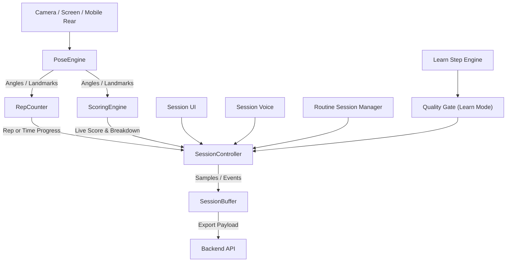

# FitPlus 코드베이스 설명서

이 문서는 현재 저장소 기준의 FitPlus 웹 애플리케이션 구조를 설명합니다.  
초점은 **Node.js / Express 백엔드**, **EJS 기반 웹 UI**, 그리고 **브라우저에서 동작하는 운동 분석 로직**에 있습니다.

---

## 1. 시스템 개요

FitPlus는 서버가 모든 운동 분석을 수행하는 구조가 아니라, **브라우저에서 포즈 추론과 채점 계산을 수행하고**, 서버는 그 결과를 **세션/루틴/히스토리 단위로 저장하고 조회하는 구조**를 따릅니다.

- **브라우저**
  - MediaPipe Pose 기반으로 랜드마크를 추론합니다.
  - 운동별 모듈과 채점 엔진으로 점수, 반복 수, 자세 피드백을 계산합니다.
  - 세션 버퍼에 점수 타임라인, 메트릭 요약, 이벤트를 모았다가 서버에 전송합니다.
- **서버**
  - JWT 쿠키 인증과 SSR 렌더링을 담당합니다.
  - 운동 세션 생성/종료, 루틴 실행 상태 관리, 스냅샷 저장, 히스토리 조회를 담당합니다.
  - AI 성장 리포트, TTS(음성 합성), 퀘스트/포인트/티어 관리를 담당합니다.
- **DB (Supabase/PostgreSQL)**
  - 사용자, 운동 메타데이터, 루틴 템플릿, 루틴 실행 상태, 운동 세션, 스냅샷, 퀘스트 데이터, 포인트/티어 데이터를 저장합니다.

---

## 2. 백엔드 구조

### 2.1 애플리케이션 엔트리 (`app.js`)

`app.js`는 Express 앱의 공통 설정과 라우터 연결을 담당합니다.

- EJS + `express-ejs-layouts`를 사용합니다.
- 정적 파일은 `public/`에서 서빙합니다.
- body parser는 `'5mb'` 기본 제한과 함께 JSON / URL-encoded를 사용합니다.
- `cookie-parser`를 사용해 쿠키 기반 인증을 처리합니다.
- `addAuthState` 미들웨어를 모든 요청에 적용해 뷰에서 로그인 상태와 테마를 사용할 수 있게 합니다.
- 라우트 연결:
  - 메인 라우트 (`/`), 운동 라우트 (`/`), TTS API (`/api/tts`), 관리자 라우트 (`/admin`)
- 서버 시작 시 `syncExerciseCatalog()`를 호출해 운동 메타데이터를 동기화합니다.
- 404 / 500 전역 에러 핸들러를 적용합니다.

### 2.2 인증 시스템 (`middleware/auth.js`)

FitPlus는 **JWT 쿠키 인증**을 사용합니다.

- **`generateToken(user)`**
  - `user_id`, `login_id`, `nickname`을 포함한 JWT를 발급합니다.
  - 만료 기간은 환경 변수 `JWT_EXPIRES_IN` (기본 `'7d'`)으로 설정됩니다.
- **`addAuthState`**
  - **UI 표시용** 미들웨어로, 모든 요청에서 토큰이 유효한지 확인합니다.
  - `res.locals.isAuthenticated`, `res.locals.user`를 채웁니다.
  - 추가로 `user_settings.theme`을 조회해 `res.locals.userTheme`을 주입합니다.
  - 이 값은 각 레이아웃에서 초기 테마를 적용할 때 사용됩니다.
  - **보안 검증용이 아니며**, 실제 인증이 필요한 API는 `requireAuth`를 사용합니다.
- **`requireAuth`**
  - 요청 헤더가 아니라 `cookie`에서 토큰을 읽습니다.
  - 검증 실패 시 쿠키를 지우고 로그인 페이지로 리다이렉트합니다.
  - 설정, 운동, 히스토리, 퀘스트, 루틴 관련 API와 페이지에 사용됩니다.
  - 검증 성공 시 `req.user`에 디코딩된 사용자 정보를 저장합니다.
- **`requireGuest`**
  - 로그인 페이지, 회원가입 페이지에 사용됩니다.
  - 이미 로그인한 사용자는 홈으로 리다이렉트합니다.
- **`handleLogout`**
  - 토큰 쿠키를 삭제하고 로그인 페이지로 리다이렉트합니다.
- **`requireAdmin`**
  - 현재 구현은 별도 role 필드가 아니라 `login_id === 'admin'` 여부로 관리자 접근을 판별합니다.

### 2.3 주요 라우터

- **`routes/main.js`**
  - 홈, 로그인, 회원가입, 로그아웃을 담당합니다.
  - 퀘스트 페이지 및 퀘스트 완료/보상 청구 API를 담당합니다.
  - 히스토리 페이지, 히스토리 상세/통계/삭제 API를 담당합니다.
  - 설정 페이지 및 닉네임/비밀번호/테마 변경 API를 담당합니다.
  - **AI 성장 리포트** 페이지 및 리포트 조회/재생성 API를 담당합니다.
  - 홈 페이지 진입 시 `assignDailyQuests`, `assignWeeklyQuests` 미들웨어가 자동 실행됩니다.
  - admin 계정은 일반 페이지 진입 시 `/admin`으로 리다이렉트됩니다.
- **`routes/workout.js`**
  - **루틴**: 목록, 생성, 상세 조회, 수정, 삭제 페이지 및 API를 담당합니다.
  - **자유 운동**: 운동 목록 페이지(`/workout/free`), 세션 페이지(`/workout/free/:exerciseCode`)를 담당합니다.
  - **운동 배우기(Learn)**: 운동 목록 페이지(`/learn`), 세션 페이지(`/learn/:exerciseCode`)를 담당합니다.
  - **루틴 운동**: 세션 페이지(`/workout/routine/:routineId`)를 담당합니다.
  - **운동 결과**: 결과 페이지(`/workout/result/:sessionId`)를 담당합니다.
  - **운동 API**: 운동 목록 조회, 세션 시작/종료/중단/세트 기록/이벤트 기록 API를 담당합니다.
- **`routes/tts.js`**
  - TTS 모델 목록 조회(`GET /api/tts/models`), 텍스트 음성 변환(`POST /api/tts/`) API를 담당합니다.
- **`routes/admin.js`**
  - 모든 라우트에 `requireAdmin` 미들웨어를 적용합니다.
  - 대시보드, 운동 CRUD, 사용자 상태 관리, 퀘스트 템플릿/할당 규칙 CRUD, 티어 규칙 관리를 담당합니다.

---

## 3. 운동 도메인 백엔드

### 3.1 운동 세션 라이프사이클 (`controllers/workout.js`)

`controllers/workout.js`는 현재 프로젝트에서 가장 큰 컨트롤러입니다.  
자유 운동, 루틴 운동, 운동 배우기를 모두 지원하며, 세션 생성부터 종료, 중단, 루틴 진행 상태 동기화까지 담당합니다.

#### 1. 세션 진입 페이지 렌더링

- **`getFreeWorkoutPage`**
  - 운동 목록 페이지를 렌더링합니다. 운동 메타데이터 동기화 후 활성 운동 리스트를 조회합니다.
- **`getFreeWorkoutSession`**
  - 운동 코드를 기준으로 운동 메타데이터를 조회합니다.
  - 허용 뷰(`allowed_views`)와 기본 뷰(`default_view`)를 붙여 세션 화면을 렌더링합니다.
  - 클라이언트에는 `scoringProfile` 형태의 객체를 넘기지만, 현재 기본값은 `source: 'RUNTIME_JS'`인 런타임 프로필입니다.
- **`getLearnPage`**
  - 운동 배우기 목록 페이지를 렌더링합니다.
- **`getLearnWorkoutSession`**
  - 운동 배우기 세션 페이지를 렌더링합니다.
  - 모드는 `'LEARN'`으로 설정되며, `workout/session` 뷰를 공유합니다.
- **`getRoutineWorkoutSession`**
  - 루틴과 루틴 단계들을 불러옵니다.
  - 첫 단계 운동을 기준으로 세션 화면을 렌더링합니다.
  - 루틴 안의 모든 운동 모듈 스크립트들을 함께 주입합니다.

#### 2. 세션 시작 (`startWorkoutSession`)

- 기존에 열려있는 **stale 세션**을 먼저 정리합니다 (`cleanupStaleOpenSessions`).
- `workout_session`에 `RUNNING` 상태 레코드를 생성합니다.
- 자유 운동과 루틴 운동의 시작 방식이 다릅니다.

자유 운동:
- 선택한 `exercise_id`로 바로 세션을 생성합니다.

루틴 운동:
- `routine_instance`를 생성합니다.
- 각 단계별 `routine_step_instance`를 생성합니다.
- 첫 단계의 첫 세트를 `workout_set`으로 생성합니다.
- 이후 `workout_session`은 해당 `set_id`와 연결되어 생성됩니다.

즉, 루틴 운동에서는 다음과 같은 실행 계층이 생깁니다.

```text
routine_instance
  -> routine_step_instance
    -> workout_set
      -> workout_session
```

#### 3. 세트 완료 동기화 (`recordWorkoutSet`)

이 API는 단순히 세트 row 하나를 저장하는 수준이 아니라, **루틴 진행 상태를 서버와 동기화하는 엔드포인트**에 가깝습니다.

- 먼저 `session_event`에 `SET_RECORD` 이벤트를 남깁니다.
- 루틴 세션이 아니면 이벤트만 저장하고 종료합니다.
- 루틴 세션이면 `ensureRoutineContinuation`을 호출하여:
  - 현재 `workout_set`을 `DONE`으로 바꾸고 실제 결과값, 점수, 지속 시간을 기록합니다.
  - 현재 단계의 완료 세트 수를 갱신합니다.
  - 필요하면:
    - 다음 세트를 생성하거나 (`NEXT_SET` + rest_sec 정보)
    - 다음 운동 단계의 첫 세트를 생성하거나 (`NEXT_STEP`)
    - 루틴 전체를 `DONE`으로 마감합니다 (`ROUTINE_COMPLETE`).
- 응답에는 `NEXT_SET`, `NEXT_STEP`, `ROUTINE_COMPLETE` 같은 액션이 포함될 수 있고, 클라이언트는 이 값을 보고 다음 화면 상태로 넘어갑니다.

#### 4. 세션 종료 (`endWorkoutSession`)

운동 종료 시 서버는 **기존 스냅샷/이벤트를 모두 삭제한 뒤 새로 생성**하는 방식으로 동작합니다.

- `session_event`를 삭제 후, 클라이언트가 보낸 이벤트 배열을 정규화하여 다시 저장합니다.
- `session_snapshot`을 삭제 후, 중간 스냅샷(`INTERIM`) + 최종 스냅샷(`FINAL`)을 생성합니다.
- `session_snapshot_score`에 스냅샷 시점 점수 요약을 저장합니다.
- `session_snapshot_metric`에 메트릭별 평균 점수와 raw value 통계를 저장합니다.
- `workout_session`에 최종 결과를 반영합니다:
  - `selected_view`, `result_basis`, `total_result_value`, `total_result_unit`, `final_score`, `summary_feedback`, `ended_at`
- 루틴 세션이면 `syncRoutineExecutionFromSession`을 통해 세트/단계/루틴 실행 상태를 동기화합니다.
- 운동 종료 시 **퀘스트 진행도**를 함께 업데이트합니다 (`updateQuestProgress`).

#### 5. 세션 중단 (`abortWorkoutSession`)

- 비정상 종료나 페이지 이탈 시 `ABORTED` 처리에 사용됩니다.
- 루틴 세션이면 연결된 `workout_set`, `routine_step_instance`, `routine_instance`도 함께 중단 상태로 맞춥니다.
- `SESSION_ABORT` 이벤트를 기록합니다.

#### 6. 세션 이벤트 기록 (`recordSessionEvent`)

- 클라이언트에서 발생한 개별 이벤트(자세 피드백, 점수 변동 등)를 실시간으로 저장합니다.

#### 7. 결과 페이지 (`getWorkoutResult`)

- `workout_session` 기본 정보와 최종 스냅샷을 함께 조회합니다.
- 최종 스냅샷의 점수/메트릭 요약을 합쳐 결과 페이지를 렌더링합니다.

### 3.2 루틴 관리 (`controllers/routine.js`)

루틴은 템플릿 자체와 실행 기록이 분리되어 있습니다.

- **템플릿**
  - `routine`
  - `routine_setup`
- **실행 기록**
  - `routine_instance`
  - `routine_step_instance`
  - `workout_set`

주요 특징:

- 루틴 수정은 기존 row를 덮어쓰지 않고 **새 버전 루틴을 생성한 뒤 이전 루틴을 비활성화**하는 방식입니다.
- 실행 중인 루틴이 있으면 수정/삭제를 막습니다 (`abortRunningRoutineExecutions` + `countRunningRoutineInstances`).
- 루틴 목록 페이지에는 최근 실행 통계(`total_runs`, `avg_score`, `best_score`, `last_run_at`)를 함께 계산해 보여줍니다.
- 루틴 상세 API는 최근 20개 실행 인스턴스와 각 스텝별 완료 현황을 함께 반환합니다.

### 3.3 히스토리 (`controllers/history.js`)

히스토리는 단순 세션 목록이 아니라, **최종 결과 + 스냅샷 시계열 + 개선 포커스 분석**을 조합하는 구조입니다.

- **메인 페이지**: 페이징(12개), 운동 필터, 기간 필터(all/today/week/month/90d), 상태 필터(DONE/ABORTED/ALL), 정렬(latest/oldest/score)을 지원합니다.
- 세션 목록은 자유 운동 세션과 루틴 실행을 하나의 리스트로 합쳐 정렬합니다.
- 세션 상세 조회 시:
  - `workout_session`
  - `session_snapshot` (INTERIM + FINAL)
  - `session_snapshot_score`
  - `session_snapshot_metric`
  - `session_event`
  - 필요 시 루틴 컨텍스트 (`loadRoutineContextBySetId`)
  를 함께 조회합니다.
- 응답에는 다음과 같은 가공 결과가 포함됩니다:
  - `timeline` (스냅샷 시계열 점수)
  - `metric_series` (메트릭별 시계열 데이터)
  - `accuracy_focus` (최고/최약 메트릭, 전체 점수 등급)
  - `improvement_focus` (우선 개선 포인트, 카메라 인사이트, 신뢰도 점수)
  - `focus_preview` (요약 미리보기)
- 루틴 히스토리 상세는 `routine_instance` 단위로 운동 순서 세트/세션 연결 정보를 계층 구조로 보여줍니다.
- 통계 API (`getHistoryStats`)는 일별/운동별 차트 데이터를 제공합니다.
- 세션 삭제 API를 지원합니다.

### 3.4 AI 성장 리포트 (`controllers/report.js`, `backend/analysis/`)

- **`getReportPage`**: 리포트 페이지를 렌더링합니다.
- **AI 성장 리포트 컨트롤러** (`backend/analysis/controller/ai-growth-report.controller.js`):
  - `getCoachReport`: 사용자의 AI 코치 리포트를 조회합니다.
  - `rebuildCoachReport`: 리포트를 재생성합니다.

### 3.5 TTS (`controllers/tts.js`)

- 음성 피드백을 위한 Text-to-Speech 기능을 제공합니다.
- `getTtsModels`: 사용 가능한 TTS 모델 목록을 반환합니다.
- `textToSpeech`: 텍스트를 음성 데이터로 변환합니다.

### 3.6 홈 / 퀘스트 / 설정 / 관리자

- **`controllers/home.js`**
  - 오늘/이번 주 운동 요약
  - 연속 운동 일수(streak)
  - 1년 출석 히트맵 (365일, 활동 레벨 0~4)
  - 홈 화면용 퀘스트 카드 (달성률 순 정렬)
  - 티어 정보 계산 (포인트 누적 기반)
  를 조합합니다.
  - 비로그인 사용자에게는 빈 데이터로 홈 화면을 렌더링합니다.
- **`controllers/quest.js`**
  - 일일/주간 퀘스트 자동 부여와 진행도 갱신을 담당합니다.
  - 다양한 퀘스트 조건(`WORKOUT_SESSION_COUNT`, `ROUTINE_COMPLETE_COUNT`, `SESSION_SCORE_COUNT`, `TOTAL_SESSION_DURATION_SEC`, `ACTIVE_DAYS_COUNT`)을 지원합니다.
  - `refreshQuestProgressForRows`로 실시간 진행도 갱신이 가능합니다.
- **`controllers/settings.js`**
  - 닉네임 변경 (2~32자), 비밀번호 변경 (argon2 해싱), 테마 변경 (light/dark/system)을 처리합니다.
  - `user_settings` 테이블에 upsert 방식으로 저장합니다.
- **`controllers/admin.js`**
  - 대시보드, 운동 CRUD, 사용자 상태 관리(active/blocked/deleted)
  - 퀘스트 템플릿 CRUD, 퀘스트 할당 규칙 CRUD
  - 티어 규칙 조회/수정을 담당합니다.

---

## 4. 프론트엔드 구조

### 4.1 렌더링 방식

프론트엔드는 React 같은 SPA가 아니라 **EJS 기반 SSR + 페이지별 Vanilla JS** 구조입니다.

- 공통 레이아웃:
  - `views/layouts/main.ejs` (일반 페이지)
  - `views/layouts/workout.ejs` (운동 세션 페이지)
  - `views/layouts/admin.ejs` (관리자 페이지)
- 페이지별 JS:
  - 히스토리: `public/js/history-page.js`
  - AI 성장 리포트: `public/js/report/report-page.js`
  - 운동 세션: `public/js/workout/session-controller.js`

### 4.2 운동 세션 클라이언트 엔진 (`public/js/workout/`)

운동 세션 페이지는 여러 모듈이 협력하는 구조입니다.



### 4.3 주요 클라이언트 모듈

#### 1. `pose-engine.js`

- MediaPipe Pose를 초기화하고 프레임 단위 추론을 수행합니다.
- 운동 채점과 반복 판정에 필요한 각도 데이터를 계산합니다.
- 랜드마크 안정화 필터링은 별도의 `one-euro-filter.js` 모듈에서 수행합니다.
- 카메라 초기화는 `session-camera.js`에서 담당합니다.

#### 2. `one-euro-filter.js`

- 원 유로 필터(One Euro Filter) 알고리즘 구현체입니다.
- 프레임 간 랜드마크 떨림을 줄여 부드러운 각도/위치 데이터를 제공합니다.

#### 3. `rep-counter.js`

- 운동별 패턴에 따라 반복 수나 시간 기반 진행 상태를 계산합니다.
- 스쿼트/푸시업처럼 rep 기반 운동뿐 아니라 플랭크처럼 time 기반 운동도 처리합니다.

#### 4. `scoring-engine.js`

현재 `ScoringEngine`은 **DB 프로필만으로 동작하지 않습니다**.

- 입력으로 `scoringProfile` 형태의 객체를 받습니다.
- 하지만 현재 서버가 주는 기본 프로필은 `source: 'RUNTIME_JS'` + 빈 `scoring_profile_metric`입니다.
- 실제 점수 기준은 운동별 JS 모듈이 제공하는 `getDefaultProfileMetrics()`를 fallback으로 사용합니다.
- 즉 현재 구조는:
  - 프로필 인터페이스는 유지
  - 실제 기본 점수 기준은 운동 모듈 기반

#### 5. `session-buffer.js`

- 프레임 점수, 반복 결과, 이벤트 로그를 버퍼링합니다.
- `localStorage` 백업을 지원합니다.
- `export()` 시 다음과 같은 정보를 묶어 서버로 넘깁니다.
  - 점수 타임라인
  - 메트릭 누적 결과
  - 반복 기록
  - 이벤트 로그
  - 중간 스냅샷 (`interim_snapshots`)
  - 최종 점수/지속 시간/횟수 요약
- 특히 이 모듈은 최종 저장용 `session_snapshot_metric`에 대응하는 메트릭 결과를 생성합니다.

#### 6. `session-controller.js`

**가장 큰 프론트엔드 모듈** (약 111KB)로, 운동 세션 페이지의 메인 오케스트레이터입니다.

- 카메라 소스 선택 (`session-camera.js` 연동)
- 허용 뷰 선택 (FRONT / SIDE / DIAGONAL)
- 운동 시작 / 일시정지 / 종료
- 루틴 단계 전환 및 세트 진행 관리 (`routine-session-manager.js` 연동)
- 플랭크 목표 시간 UI
- 세션 버퍼 export
- `/api/workout/session/:id/end`, `/api/workout/session/:id/set`, `/api/workout/session/:id/abort` 연동
- Learn 모드의 퀄리티 게이트 처리 (`quality-gate-session.js` + `learn-step-engine.js` 연동)

루틴 운동에서는 서버 응답의 `NEXT_SET`, `NEXT_STEP`, `ROUTINE_COMPLETE` 액션에 따라 다음 상태로 넘어갑니다.

#### 7. `session-ui.js`

- 운동 세션 화면의 UI 업데이트를 담당합니다.
- 점수 게이지, 반복 카운터, 피드백 메시지 표시를 관리합니다.

#### 8. `session-voice.js`

- TTS를 활용한 음성 피드백을 담당합니다.
- 운동 중 실시간 음성 안내를 제공합니다.

#### 9. `session-camera.js`

- 카메라 초기화 및 전환을 담당합니다.
- 전면/후면 카메라, 화면 공유 소스 선택을 지원합니다.

#### 10. `routine-session-manager.js`

- 루틴 운동 중 세트/단계 전환 로직을 관리합니다.
- 서버의 `NEXT_SET`/`NEXT_STEP` 응답을 처리합니다.

#### 11. `exercise-registry.js`

- 운동별 모듈을 중앙에서 관리하는 레지스트리입니다.
- 운동 코드에 따라 적절한 exercise 모듈을 찾아 바인딩합니다.

#### 12. `learn-step-engine.js`

- 운동 배우기(Learn) 모드의 단계별 학습 엔진입니다.
- 각 단계(안내 → 시연 → 수행 → 평가)를 순차적으로 진행합니다.

#### 13. `quality-gate-session.js`

- Learn 모드에서 특정 조건(자세 정확도 등)을 만족해야 다음 단계로 넘어가는 퀄리티 게이트를 구현합니다.

#### 14. `onboarding-guide.js`

- 신규 사용자를 위한 온보딩 가이드 UI를 제공합니다.

#### 15. 운동별 모듈 (`public/js/workout/exercises/*.js`)

현재 운동별 로직은 운동 전용 모듈에 나뉘어 있습니다.

- `squat-exercise.js`
- `push-up-exercise.js`
- `plank-exercise.js`

이 모듈들은 대체로 다음 책임을 가집니다.

- 운동별 phase 정의
- 반복 판정 조건
- 기본 프로필 메트릭 제공 (`getDefaultProfileMetrics()`)
- 운동 특화 피드백/보조 계산
- EXERCISE_MANIFEST 주석을 통한 운동 메타데이터 정의 (카탈로그 동기화에 사용)

---

## 5. 데이터 저장 구조

현재 코드 기준의 핵심 저장 구조는 아래와 같습니다.

### 5.1 사용자 / UI 설정

- `app_user`
- `user_settings`

### 5.2 운동 메타데이터

- `exercise`
- `exercise_allowed_view`

### 5.3 루틴 템플릿

- `routine`
- `routine_setup`

### 5.4 루틴 실행 계층

- `routine_instance`
- `routine_step_instance`
- `workout_set`

### 5.5 실제 운동 세션

- `workout_session`

자유 운동은 `workout_session` 중심으로 저장되고, 루틴 운동은 `set_id`를 통해 `workout_set`과 연결됩니다.

### 5.6 세션 분석 결과

- `session_snapshot`
- `session_snapshot_score`
- `session_snapshot_metric`
- `session_event`

즉, 현재 히스토리와 분석 기능은 `workout_session` 한 row만으로 완성되지 않고, **스냅샷/이벤트 계층**을 함께 사용합니다.

### 5.7 퀘스트 / 포인트 / 티어

- `quest_template` - 퀘스트 템플릿 (조건, 보상, 난이도, 배타 그룹 등)
- `quest_assignment_rule` - 퀘스트 자동 할당 규칙
- `user_quest` - 사용자별 퀘스트 진행 상태
- `user_point` - 사용자 포인트 적립 내역
- `tier_rule` - 티어별 필요 포인트 기준

---

## 6. 구현상 특징과 주의점

- 이 프로젝트는 **SSR 웹앱 + 브라우저 AI 엔진**의 혼합 구조입니다.
- 운동 채점은 "완전한 서버 중심"도 아니고 "완전한 DB 규칙 중심"도 아닙니다.
- 현재 기본 채점 기준은 **운동별 JS 모듈의 런타임 정의**에 더 가깝습니다.
- 루틴 실행은 템플릿과 실행 상태가 분리되어 있어 히스토리와 재시도 처리가 비교적 명확합니다.
- 히스토리 화면은 단순 목록이 아니라 세션별 스냅샷 시계열과 개선 포인트 계산까지 포함합니다.
- 세션 종료 시 기존 스냅샷/이벤트를 삭제 후 재생성하는 방식이므로, **멱등성(endWorkoutSession 재호출 방지)** 처리가 필요합니다.
- 운동 시작 전 `cleanupStaleOpenSessions`가 실행되어 12시간 이상 방치된 세션을 자동 정리합니다.
- 운동 종료 후 `updateQuestProgress`를 통해 퀘스트 진행도가 자동 갱신됩니다.
- `one-euro-filter.js`는 `pose-engine.js`에서 분리된 독립 모듈입니다.

---

## 7. 관련 문서

- `docs/database_structure.md`
  - 테이블 구조 설멍 (전체 스키마 상세)
- `docs/specs/` 디렉토리
  - 세부 기능 명세 및 버그 수정 기록 (날짜별 마크다운 파일)
- `docs/plans/` 디렉토리
  - 구현 계획 문서
- `docs/sql/` 디렉토리
  - DB 마이그레이션 SQL 스크립트
- `docs/validation/` 디렉토리
  - 유효성 검증 관련 문서
